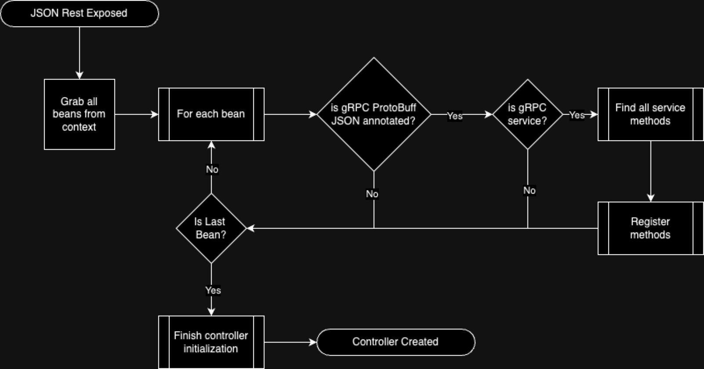
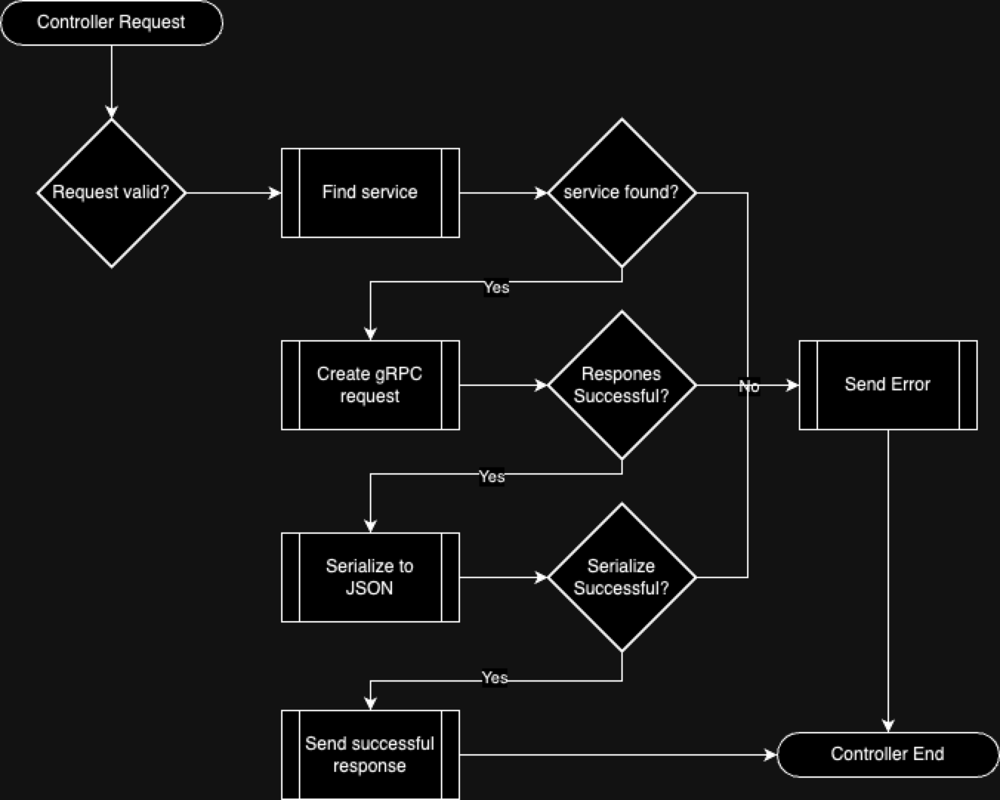

This project also includes a module that adds the ability to send json-serialized messages via a POST HTTP 1.1 call with the Micronaut HTTP
server.

To use this add the `micronaut-protobuff-json-support` dependency:

dependency:micronaut-protobuff-json-support[groupId="io.micronaut.grpc"]

Since this is an experiemental feature, you must also include the following property in your project:

`grpc.rest.json.exposed=true`

And then include the `@GrpcRestJsonExposed` annotation on your gRPC service definition:

[source,java]
----
@Singleton
@GrpcRestJsonExposed
public class GreeterService extends GreeterGrpc.GreeterImplBase {
----

Micronaut will now support the encoding and decoding requests / responses of type `application/json` via http 1.1.

== How this works

== Controller Creation

1. After the controller is created, the post creation annotation will traverse the beans created with the `@GrpcRestJsonExposed` annotation.
2. For each bean, peek into the gRPC allocated methods created.
3. Register the bean in a cache

== Controller usage

=== How it works
The controller endpoint will use google's built-in JSON/ProtocolBuffer serialization.Unfortunately, there is not yet a way to print a
full API schema for a request.However, to create a json request output one can take any gRPC request protocol buffer and convert it to
json using the `io.micronaut.protobuf.json.ProtobufJsonTranscoder` class.

[#_usage]
== Usage
Request comes in and matches as:

[source]
----
/grpc-json/{serviceName}/{method}
----

where the `serviceName` is the name of the gRPC service and the `method` is the name of the method.

Here's an example of a gRPC service definition.

For example:

[source,protobuf]
----

service Greeter {
  // Sends a greeting
  rpc SayHello (HelloRequest) returns (HelloReply) {}
}
----

In this case, the request would look like this:

`http://localhost:8080/grpc-json/GreeterService/sayHello`

Where `GreeterService` is the service name and `sayHello` is the method name.

The payload would look like this:

[source,json]
----
{"name": "YourName"}
----

Take in a `POST` as `application/json` and the request should cleanly map as a grpc response.

== Example client usage with `cURL`

If you run the `test-suite-java-rpc-json-demo` project and issue the following cURL call:

[source,bash]
----
curl -X POST http://localhost:8080/grpc-json/GreeterService/sayHello \
-H "Content-Type: application/json" \
-d '{"name": "YourName"}'
----

